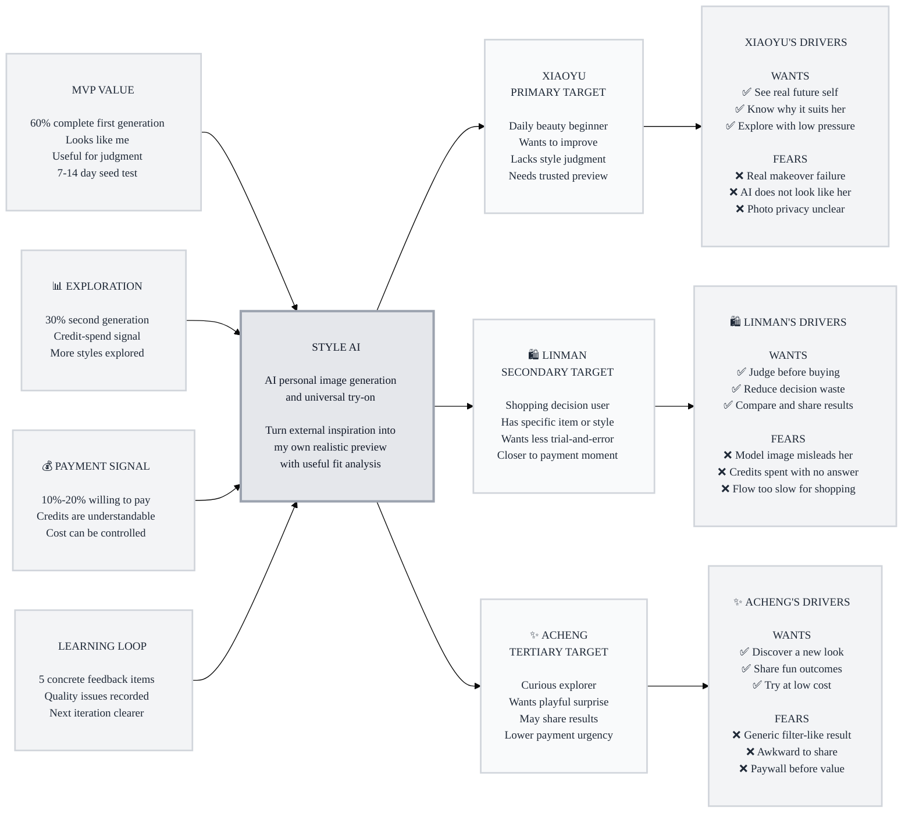

# Trigger Map: style-ai

> 连接业务目标、目标用户心理和 MVP 设计优先级的战略参考。

**Created:** 2026-05-11
**Author:** Sue
**Methodology:** Based on Effect Mapping, adapted by WDS with positive and negative driving forces
**Mode:** Dream

---

## Strategic Summary

Style AI 的 Phase 2 结论是：MVP 不应该把重点放在"功能多"或"像竞品一样做试穿"，而应该优先验证一个更尖锐的心理命题：

**用户看到足够像自己的风格生成结果后，是否会相信它可以帮助自己做真实判断，并愿意继续花额度探索。**

因此，第一版体验必须围绕"看见我自己"、"知道为什么适合/不适合"、"照片和档案使用可信"、"额度消耗透明"来组织。万能试穿/试造型是重要入口，但必须服务这个核心判断，不应变成泛化图片工具。

---

## Vision

Style AI 是日常变美新手的个人风格试验室。它帮助用户在真正烫头、买衣服、换妆容或尝试配饰前，先看到自己在不同主流风格下的逼真效果，并获得清晰、温和、可执行的适配分析。

---

## Business Objectives

### Objective 1: 验证首次真实预览价值

- **Metric:** 首次生成完成率 + 结果可判断反馈
- **Target:** 20-50 个种子用户中，至少 60% 完成首次个人形象生成或试穿生成，并表示结果"像自己、可用于判断"
- **Timeline:** 7-14 天种子测试周期
- **Priority:** PRIMARY - THE ENGINE
- **Reasoning:** 如果用户不相信第一次结果有判断价值，二次生成、额度付费和长期档案都没有基础。

### Objective 2: 验证继续探索动机

- **Metric:** 二次生成率
- **Target:** 至少 30% 用户在首次生成后进行第二次生成
- **Timeline:** 7-14 天种子测试周期
- **Priority:** SECONDARY
- **Reasoning:** 二次生成是"看完一次觉得有用"和"愿意继续探索"之间最直接的行为信号。

### Objective 3: 验证额度付费意愿

- **Metric:** 购买额度或明确付费意愿
- **Target:** 10%-20% 用户愿意购买生成额度，或明确表示愿意为更多生成付费
- **Timeline:** 7-14 天种子测试周期
- **Priority:** SECONDARY
- **Reasoning:** 图片生成有可变成本，付费意愿决定这个 B2C 模式能否继续投入。

### Objective 4: 建立高质量学习闭环

- **Metric:** 可行动反馈数量
- **Target:** 至少 5 个用户给出具体反馈，并记录生成失败、不像本人、风格跑偏、照片质量等关键问题
- **Timeline:** 第一轮种子测试结束前
- **Priority:** SUPPORTING
- **Reasoning:** MVP 的胜负不只在单次指标，也在能否快速知道哪里不像、哪里误导、哪里让用户不信任。

---

## Target Groups

### 1. 小雨 - 主动想变美但缺少判断力的新手

**Priority:** PRIMARY

小雨代表 Style AI 最核心的用户：她主动想变好看，经常收藏发型、穿搭、妆容参考，也愿意上传照片尝试，但她真正缺的是判断力。她不是不知道外面有什么风格，而是不知道这些风格放到自己脸型、身材、气质和日常场景里会不会成立。

**Why she is first:** 如果小雨被打动，说明 Style AI 的核心价值成立：产品真的能把"别人好不好看"转成"我自己这样会怎样"。她的信任和二次生成是所有商业目标的引擎。

### 2. 林曼 - 购物和改变前的决策型用户

**Priority:** SECONDARY

林曼有更明确的即时任务：买衣服、买配饰、换发型、做造型前，她想降低买错、剪错、搭错的风险。她通常已经在小红书、电商、朋友圈或线下店看到了目标款式，但还卡在"这个放到我身上会不会合适"。

**Why she is second:** 她的付费意图更接近交易场景，对额度付费可能更敏感也更直接。但如果产品只服务购物决策，就会变成泛化试穿工具，失去 Style AI 对日常变美新手的长期价值。

### 3. 阿澄 - 轻度好奇和分享型用户

**Priority:** TERTIARY

阿澄没有强烈的变美任务，但愿意用免费额度玩一玩，看自己能不能变成不同风格。她的动机更像"看看效果"和"好玩就分享"，如果结果惊喜，可能带来传播和后续转化。

**Why she is third:** 她能带来冷启动扩散，但她的付费和留存信号弱于前两类用户。MVP 不能为了娱乐性牺牲核心判断价值。

---

## Driving Forces

### 小雨的驱动力

**Positive Drivers:**

1. **想先看到真实的自己会变成什么样**
   - 她不缺灵感，缺的是"放到我身上"的真实预览。
   - **Style AI Promise:** 用本人照片生成主流形象方向，让她先看到可判断的结果。

2. **想知道为什么适合或为什么要谨慎**
   - 她需要解释，而不是一句"适合/不适合"。
   - **Style AI Promise:** 每个推荐和避坑都给日常中文理由，保留用户选择权。

3. **想低成本、低压力地多试几种方向**
   - 她害怕现实试错成本，但愿意在数字空间探索。
   - **Style AI Promise:** 用少量免费额度建立第一次信任，再用额度支持继续探索。

**Negative Drivers:**

1. **怕真实尝试翻车**
   - 剪错头发、买错衣服、妆容不适合，都会带来金钱、时间和社交尴尬成本。
   - **Style AI Answer:** 把高成本现实尝试前置为低成本视觉预演。

2. **怕 AI 生成不像本人，反而误导判断**
   - 如果脸不像、身材不准、风格跑偏，她会立刻失去信任。
   - **Style AI Answer:** 优先设计照片质量引导、失败提示、重试机制和反馈入口。

3. **怕上传照片后被默认长期保存**
   - 个人形象照片是信任门槛，不能模糊处理。
   - **Style AI Answer:** 明确区分"本次生成照片"和"保存为常用形象"，默认不强迫建档。

### 林曼的驱动力

**Positive Drivers:**

1. **想在购买或改变前快速做判断**
   - 她不是漫无目的探索，而是有一个具体对象要验证。
   - **Style AI Promise:** 支持外部参考图导入，把衣服、发型、配饰或妆容试到自己身上。

2. **想减少反复纠结和退换成本**
   - 她愿意为节省决策时间和降低试错风险付费。
   - **Style AI Promise:** 生成后提供清晰适配判断、推荐理由和谨慎点。

3. **想保留结果用于比较和询问朋友**
   - 她常需要在多个选项之间比较。
   - **Style AI Promise:** 保存历史结果，支持对比、收藏和分享。

**Negative Drivers:**

1. **怕模特图好看但自己穿不好看**
   - 这是电商和小红书参考图的核心短板。
   - **Style AI Answer:** 直接把外部灵感转换为本人预览。

2. **怕花了额度还是没有明确结论**
   - 付费用户更在意每次生成是否有用。
   - **Style AI Answer:** 生成结果必须附带"推荐/谨慎/原因/下一步"。

3. **怕流程太麻烦，赶不上即时决策**
   - 购物场景很短，步骤多就会流失。
   - **Style AI Answer:** 双入口首页、快速导入、复用常用形象，但不强制建档。

### 阿澄的驱动力

**Positive Drivers:**

1. **想看到意外的新鲜形象**
   - 她追求惊喜和好玩，不一定马上做现实改变。
   - **Style AI Promise:** 提供主流风格方向和轻量试验，让她快速看到不同版本的自己。

2. **想把有趣结果分享给朋友**
   - 分享是她的价值确认方式。
   - **Style AI Promise:** 提供保存和分享，但避免过度社区化。

3. **想免费或低成本体验 AI 变风格**
   - 她对付费敏感，先要被效果打动。
   - **Style AI Promise:** 免费额度用于展示核心价值，付费入口在价值出现后再出现。

**Negative Drivers:**

1. **怕结果普通、像滤镜或模板**
   - 如果没有"这是我"的感觉，她会很快离开。
   - **Style AI Answer:** 优先保证本人相似度和风格差异，而不是堆选项。

2. **怕分享后被朋友吐槽**
   - 娱乐用户也有形象压力。
   - **Style AI Answer:** 文案和结果呈现避免外貌打击，给用户撤回和不保存的自由。

3. **怕还没看到价值就被要求付费**
   - 过早付费会破坏玩一玩的入口。
   - **Style AI Answer:** 明确免费额度、消耗规则和剩余额度。

---

## Prioritization

### Ranked Business Goals

1. **首次真实预览价值** - 决定产品是否成立。
2. **继续探索动机** - 决定额度模型是否有行为基础。
3. **额度付费意愿** - 决定 B2C 商业模型是否可继续投入。
4. **高质量学习闭环** - 决定第二轮迭代速度。

### Ranked Target Groups

1. **小雨 / 主动想变美但缺少判断力的新手**
   - 她最贴合产品愿景，也最能验证"真实预览 + 适配分析"的核心价值。
2. **林曼 / 购物和改变前的决策型用户**
   - 她的购买意图强，但更容易把产品拉向单一试穿工具。
3. **阿澄 / 轻度好奇和分享型用户**
   - 她有传播价值，但不能成为 MVP 设计中心。

### Must Address

- 本人相似度和结果可信度。
- 生成结果能帮助判断，而不只是好看图片。
- 推荐、谨慎尝试和原因解释。
- 照片使用、保存档案、历史结果三者的清晰边界。
- 额度消耗、剩余次数和失败处理透明。

### Should Address

- 外部参考图快速导入。
- 多结果对比、保存和分享。
- 常用形象可选保存，减少重复上传。
- 低压、温和、生活化的结果文案。
- 种子用户反馈入口。

### Could Address Later

- 社区/广场。
- 达人合作和内容种草链路。
- 专业造型师服务。
- B 端商家后台。
- 多模型选择或复杂生成参数。

---

## Trigger Map Visualization

---

## Design Focus Statement

Style AI 的 MVP 应把日常变美新手从"我不知道这个风格放到我身上会怎样"转变为"我看到了足够像自己的效果，也知道为什么可以尝试或需要谨慎"，像一个低压力的个人风格试验室，而不是一个替用户审判外貌的专家工具。

**Primary Design Target:** 小雨 - 主动想变美但缺少判断力的新手

**Must Address:**

1. "结果要像我" -> 照片质量引导、失败重试、人像相似度反馈。
2. "我要能判断" -> 每个结果给推荐/谨慎点/原因。
3. "我怕照片被乱存" -> 本次照片、历史结果、常用形象档案分开说明。
4. "我怕真实翻车" -> 强调低成本预演，不承诺唯一正确答案。
5. "我不想还没看到价值就付费" -> 免费额度先展示核心效果，额度消耗透明。

**Should Address:**

1. 林曼需要快速导入参考图 -> 首页保留并列入口。
2. 林曼需要对比决策 -> 历史、收藏、分享和多结果浏览。
3. 阿澄需要新鲜感 -> 主流风格枚举和轻量分享。
4. 种子测试需要学习 -> 每次结果后收集"像不像、能不能判断、哪里不对"。
5. 付费验证需要克制 -> 购买入口在用户看到价值后出现。

---

## Cross-Group Patterns

### Shared Drivers

- 都需要把抽象灵感变成"我自己身上的效果"。
- 都会被生成质量、人像相似度和风格稳定性影响信任。
- 都需要低摩擦入口，不想学习复杂 AI 工具。
- 都在意照片和档案的边界，只是敏感程度不同。

### Unique Drivers

- 小雨最需要温和解释和长期信心建立。
- 林曼最需要即时决策、外部参考图导入和对比。
- 阿澄最需要惊喜、低成本和可分享。

### Potential Tensions

- 购物决策想要速度和结论，变美新手需要解释和安全感。
- 好奇用户想玩，付费模型需要控制免费额度成本。
- 常用形象能提升效率，但强制建档会伤害隐私信任。

---

## Design Implications

### Onboarding Must

- 登录必要性要解释为额度、历史和账号管理，而不是强迫建档。
- 第一次上传照片前说明：本次生成照片和常用形象档案是两件事。
- 不要把隐私说明藏在长协议里，关键选择要在动作发生前出现。

### Home Must

- 首页保留两个并列入口：生成我的形象方案、试穿/试造型。
- 默认引导小雨先完成个人形象生成，因为这是最能验证核心价值的路径。
- 试穿入口服务林曼的即时场景，但不压过主入口。

### Generation Result Must

- 结果不只给图，还要给判断：推荐方向、谨慎点、原因。
- 文案必须温和具体，避免"显老、土、丑、脸大"等打击式标签。
- 给用户下一步：换风格、重新生成、保存结果、保存为常用形象。

### Credit System Must

- 在生成前后都展示本次消耗、剩余额度、失败处理。
- 免费额度要足够展示价值，但不能让高成本生成失控。
- 付费入口应在用户完成一次可用结果后出现。

### Feedback Must

- 种子测试期每次生成后收集三类反馈：像不像、能不能判断、哪里不对。
- 失败、跑偏、不像本人要能被记录成下一轮优化任务。
- 反馈入口要轻，不打断用户继续探索。

---

## Related Documents

- [Primary Persona - 小雨](personas/01-xiaoyu-primary-beginner.md)
- [Secondary Persona - 林曼](personas/02-linman-shopping-decider.md)
- [Tertiary Persona - 阿澄](personas/03-acheng-curious-explorer.md)
- [Feature Impact Analysis](feature-impact-analysis.md)

---

## Research Sources

- Google Shopping AI Mode virtual try-on update: https://blog.google/products/shopping/google-shopping-ai-mode-virtual-try-on-update/
- Google Labs Doppl: https://blog.google/technology/google-labs/doppl/
- Perfect Corp generative AI hairstyling: https://www.perfectcorp.com/business/news/gen-ai-hairstyle-youcam-makeup
- Perfect Corp YouCam AI Beauty Agent: https://www.businesswire.com/news/home/20251110601035/en/Perfect-Corp.-Launches-YouCam-AI-Beauty-Agent-in-YouCam-Makeup-App-to-Lead-the-Next-Generation-of-Conversational-AI-in-Beauty-Skincare-and-Fashion
- KPMG 2025 China beauty market industry report release: https://kpmg.com/cn/zh/home/media/press-releases/2025/11/2025-china-beauty-market-industry-report.html
- Virtual Try-On Systems in Fashion Consumption systematic review: https://www.mdpi.com/2076-3417/14/24/11839

