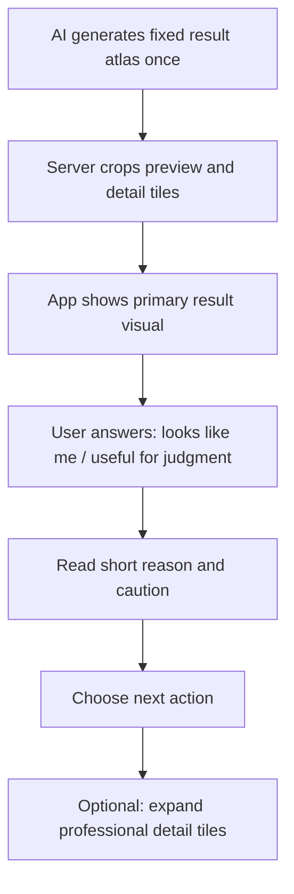

# 01.7 Image Result Redesign Review

**Date:** 2026-05-15  
**Scope:** `01.7-image-result` design specs, work/story files, current HTML prototype, generated long report asset, and related strategic documents.  
**Review Question:** Why does the current result page feel wrong after adding the AI-generated long report image, and what needs to change before redesign?

## Summary

The current page passes object-ID and state checks, but it does not pass qualitative product review. The AI long report is useful as an asset direction, but the page has turned into a report container instead of a first-result decision page.

The core WDS goal is: user sees a result that feels like herself, quickly judges whether it is useful, then chooses one next action. The current implementation asks the user to scroll through a large report before she can comfortably decide, save, compare, or give feedback.

## Evidence Sources

- `_bmad-output/C-UX-Scenarios/01-xiaoyu-first-preview/01.7-image-result/01.7-image-result.md`
- `_bmad-output/P-Prototypes/01-xiaoyu-first-preview-Prototype/work/01.7-image-result-Work.yaml`
- `_bmad-output/P-Prototypes/01-xiaoyu-first-preview-Prototype/stories/01.7.1-image-result-full-page.md`
- `_bmad-output/P-Prototypes/01-xiaoyu-first-preview-Prototype/01.7-image-result.html`
- `_bmad-output/P-Prototypes/01-xiaoyu-first-preview-Prototype/assets/image-result-ai-hair-analysis-long.png`
- `_bmad-output/B-Trigger-Map/trigger-map.md`
- `_bmad-output/A-Product-Brief/product-brief.md`
- `_bmad-output/C-UX-Scenarios/04-xiaoyu-seed-feedback/04.1-result-quick-feedback-panel/04.1-result-quick-feedback-panel.md`

## Main Findings

### 1. The page no longer centers the success metric

The 01.7 spec defines success as: user can evaluate "像不像自己" and "能不能用于判断", then take at least one next action. The current page shows those questions only in the full feedback panel near the bottom, after the result viewer, analysis card, full long report image, next-action group, and profile prompt.

This makes the most important judgment signal feel like a survey at the end, not the central moment of the result page.

### 2. The long report is promoted too early

The long report image is 720x2545 and visually dominates the page. It contains useful analysis structure, but putting the full image inline by default makes the page read as "AI report viewer" rather than "my first generated result".

The HTML copy reinforces this wrong framing with user-visible phrases such as "AI 生成分析图", "一张适合手机阅读的纵向报告", and "Prototype asset. 生产环境中这里应替换...". This is implementation language leaking into product UI.

### 3. There are two competing result objects

The top result viewer is a CSS-drawn placeholder avatar. The long report also contains a portrait preview and hair recommendation visuals. The page does not clearly answer: which image is the actual generated result?

For a product whose value is "先让用户看到自己", this ambiguity is costly. The first visual should be the generated result or a credible result preview. The report should explain it, not compete with it.

### 4. The fit summary is missing the actual "why"

The spec requires recommended direction, suitable reasons, and cautious notes. The current UI shows only two compact chips: "推荐方向" and "谨慎点". The fallback data includes `recommendationReason`, and the script tries to write it into `image-result-reason-copy`, but that element does not exist in the HTML.

So the page claims to give judgment, but the practical reason layer is missing.

### 5. Action order creates cognitive burden

The default sequence is:

```text
Result viewer -> long analysis report -> next actions -> save as profile -> feedback form
```

That order delays the user's decision. A better result page sequence is:

```text
Result viewer -> quick judgment -> concise recommendation -> primary actions -> optional details
```

The long report, profile save prompt, and feedback form should be secondary or progressive. They should not all appear as full-weight sections in the default scroll.

### 6. The specs and work files are now inconsistent with the implementation

The work file still says the prototype does not use a real generated image URL and uses a CSS-rendered placeholder. The current implementation adds a generated long report image and treats it as a future backend-returned report URL.

Before redesigning HTML, the specs should be updated to distinguish:

- generated preview image/result image
- concise fit summary
- optional full AI analysis report image
- structured feedback payload

Without that distinction, future implementation will keep mixing "result", "analysis", and "report" into one surface.

### 7. Visual style is not yet integrated

The long report has a valid direction: visual, structured, mobile-readable. But it uses a separate beige/green/red report language that does not yet feel like the same Style AI system as the dark mobile prototype.

This does not mean the long report should be discarded. It means it should be reframed as a secondary detailed report, then restyled or cropped so it supports the result page instead of visually taking over it.

## Recommended Redesign Direction

### Page-level principle

01.7 should be a decision page, not a document page. It should also avoid the opposite extreme of splitting the user's hard-won result into a separate "image page" and "analysis page".

The design decision is: **single-generation fixed atlas + App-composed result page**.

This means the image model generates once into a fixed visual atlas/contact sheet, the server crops known regions, and the App composes those pieces with native text, actions, and feedback. This balances three constraints:

- Multi-image generation is too expensive for the MVP cost model.
- One full long image is hard to read and interact with inside a mobile App result page.
- Professional analysis still matters, but it should appear as progressive depth, not as a wall before the user can act.

The user flow should be:



### Proposed default structure

1. **Top result viewer**
   - Use the cropped primary preview from the fixed result atlas as the hero.
   - Keep overlays minimal: style name, result count, save shortcut.
   - Avoid replacing the result with the full analysis report.

2. **Immediate judgment strip**
   - "像不像你自己？" with 2-3 quick choices.
   - "能不能帮你判断现实里要不要尝试？" with 2 quick choices.
   - This can write into the same feedback payload, but visually it is part of result judgment.

3. **Short fit summary**
   - One recommendation sentence.
   - Two reason bullets.
   - One cautious point.
   - No total score.

4. **Primary actions near the summary**
   - Primary: "换个风格看看" or "再生成一个方向".
   - Secondary: "保存这个结果".
   - Tertiary: "先回首页".

5. **Full analysis report as optional detail**
   - Default collapsed card: "查看更完整的发型分析".
   - Show cropped analysis tiles from the fixed atlas, not the full 2545px image by default.
   - Expanding can show more tiles or a dedicated detail layer, but this is not a required second page in the default flow.

6. **Common profile prompt after value or save**
   - Trigger after save/result engagement, or keep compact.
   - Keep the history/profile distinction, but reduce default weight.

7. **Feedback panel as drawer/compact module**
   - The 04.1 spec says feedback should be light and not interrupt exploration.
   - Use a compact feedback entry near the result judgment, with expanded detail only when needed.

## Required Spec Updates Before Code

1. Update `01.7-image-result.md` to document the fixed-atlas generation/display decision.
2. Change the layout structure so similarity/judgment feedback appears immediately after the result viewer.
3. Update `01.7-image-result-Work.yaml` to state that the full long report is not default primary content and that App composition uses cropped visual tiles.
4. Update the story acceptance criteria to include qualitative checks:
   - first viewport shows result and judgment path
   - user can reach primary actions without scrolling through the full report
   - no implementation/prototype copy appears in the user UI
   - fit summary includes a reason, not only labels
5. Update demo data shape to include:
   - `previewImageUrl`
   - `analysisAtlasUrl`
   - `detailTileUrls`
   - `cropMetadata`
   - `recommendedDirection`
   - `reasonBullets`
   - `cautionNote`

## Implementation Notes For Redesign

- Remove user-facing "Prototype asset" and "生产环境中..." copy from the page.
- Add the missing `image-result-reason-copy` or replace it with a proper reason list.
- Do not nest multiple cards inside a larger card unless the visual hierarchy is flattened.
- Keep the long report/atlas direction, but render cropped tiles as expandable detail rather than a full inline report.
- Move next actions above the full report.
- Convert the full feedback form into progressive disclosure.
- Keep prototype state controls, but visually separate them from the user page or hide them behind a dev-only section.

## Verdict

This should be redesigned from the information architecture level, not polished in place. The chosen direction is one result page composed by the App from a single AI-generated fixed atlas, with professional analysis available as progressive detail.

The next good step is to revise the 01.7 spec and work file first, then rebuild the HTML around the shorter decision flow.
